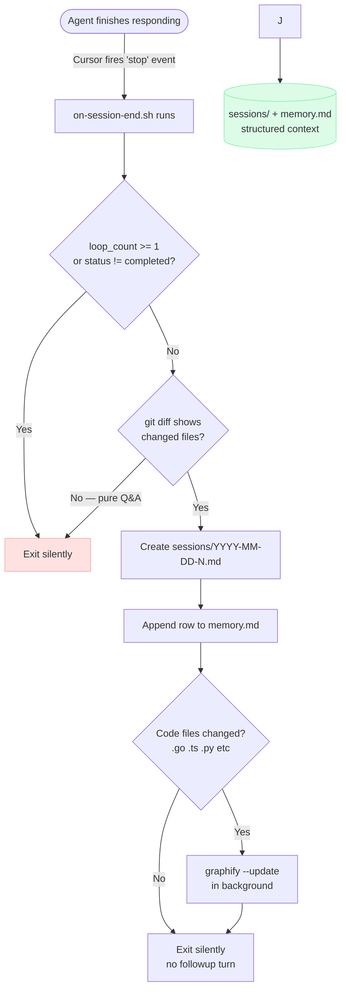

# memory-graph

Give any repo a persistent brain that survives agent sessions.

Three things it does:
1. **`main.mdc`** — a living AI brief always loaded by Cursor. Populated by graphify with architecture, god nodes, and community structure. The agent reads this before touching anything.
2. **Session memory** — after every agent stop **where at least one file was changed**, a hook creates `sessions/YYYY-MM-DD-N.md`. You append caveman-style "why" bullets. `memory.md` is the index. Pure Q&A sessions with no file changes produce no session file.
3. **Graph rebuild** — incremental AST update on every agent stop (fast, no LLM). Full rebuild on every `git commit` (via post-commit hook).

---

## How it works



**Next session:** agent auto-loads slim `main.mdc` (purpose + god nodes), runs graph scout subagent for traversal, and reads `memory.md` / session `context:` fields as needed.

---

## Install (one command, from inside your project)

```bash
cd /your/project
curl -sL https://github.com/SundaraSwani/memory-graph/archive/refs/heads/main.tar.gz \
  | tar -xz --strip-components=1 && bash setup
```

This extracts `.cursor/`, `CLAUDE.md`, `memory.md`, `sessions/` directly into your project — no wrapper folder. Then `bash setup` configures repo name, installs graphify + gstack, and wires the git post-commit hook.
Then run `/graphify .` once to build the initial graph and populate `main.mdc`.

---

## What gets installed

| File | What it does |
|------|-------------|
| `.cursor/rules/main.mdc` | AI brief — always loaded by Cursor (`alwaysApply: true`) |
| `.cursor/hooks.json` | Registers `on-session-end.sh` on the Cursor `stop` event |
| `.cursor/hooks/on-session-end.sh` | Creates session file, updates memory.md, runs graphify, prompts agent |
| `CLAUDE.md` | Points Claude Code to `main.mdc` |
| `memory.md` | Index of all sessions |
| `sessions/` | Per-session decision logs |
| `post-commit.sh` | Full graphify rebuild — installed to `.git/hooks/post-commit` |

---

## How sessions work

The hook fires at agent stop, checks `git diff` (staged + unstaged), and **exits silently** if nothing changed or the change is low-signal.

**Skipped (no session file):**
- Pure Q&A (no file changes)
- Changes only under `.cursor/`, `sessions/`, `memory.md`, `graphify-out/`
- Fewer than 3 files changed **and** no HIGH/CRITICAL god node in blast radius

**When a session is created**, the hook writes structured YAML only — no extra agent turn:

```yaml
---
date: 2026-06-17
time: 14:32
session: 1
topics: "src/auth, src/db"
scope:
  - src/auth.ts
  - src/db.ts
god_nodes_touched: []
open: []
blocked: []
context: ""
facts: []
---
```

The agent may append `context:` and `open:` **inline in the same turn** if the next session needs to know something git diff won't show. No prose "Decisions" sections. Add `facts:` only when graph scout flagged HIGH/CRITICAL nodes.

`memory.md` index row is added automatically.

> **Note:** If `context:` is already filled, the hook won't overwrite that session file.

---

## Memory compression

Three tiers — hot / warm / cold — so agents read ~20 lines instead of 50 session files:

| Tier | File | What the agent reads |
|------|------|----------------------|
| **Hot** | `memory/state.yaml` | Merged `open`, `blocked`, `recent_context`, `god_nodes_recent` |
| **Warm** | `sessions/*.md` | Last 14 days of per-session YAML |
| **Cold** | `sessions/archive/YYYY-MM.yaml` | Older sessions rolled up by month |

`compress-memory.py` runs automatically after each session hook and on `git commit`. **No LLM** — deterministic merge only.

```bash
# Manual run
python3 .cursor/hooks/compress-memory.py

# Tune retention
MEMORY_ARCHIVE_DAYS=7 MEMORY_INDEX_KEEP=20 python3 .cursor/hooks/compress-memory.py
```

Optional **LLM compression** (not built-in): run a monthly subagent that reads `sessions/archive/` and writes 5 lines to `memory/state.yaml` — use only if deterministic rollup loses too much signal.

**Sandbox test** (isolated `/tmp` dirs, no network, no LLM):

```bash
bash scripts/test.sh              # full suite (static + sandbox)
bash scripts/test-static.sh       # fast syntax/contract checks only
bash scripts/test-compress-sandbox.sh
```

**Before `git push`** — install the pre-push hook (memory-graph repo development):

```bash
bash scripts/install-dev-hooks.sh
```

This blocks push if tests fail. Bypass only when intentional: `git push --no-verify`.

---

| Trigger | What runs | LLM? |
|---------|-----------|------|
| Agent stop (code files changed) | Incremental AST update | No |
| `git commit` | Full `--update` rebuild | Only for new docs/images |
| Manual `/graphify .` | Full pipeline | Yes |

---

## gstack integration (optional)

Install with `INSTALL_GSTACK=1 bash setup`. gstack adds SDLC skills (`/spec`, `/review`, `/qa`, `/ship`); memory-graph handles structural memory and graph traversal.

| Layer | Tool | What it stores |
|-------|------|---------------|
| Structural | graphify → god nodes in `main.mdc` | Load-bearing nodes + risk |
| Full architecture | `graphify-out/GRAPH_REPORT.md` | Communities, connections (via graph scout) |
| Session context | `sessions/` + `memory.md` | Scope, open items, one-line context |
| Cross-session learnings | gstack `/learn` (opt-in) | Patterns, preferences |

## Requirements

- Cursor (for hooks + `.mdc` rules)
- Python 3.8+ (for graphify)
- Git
- Bun v1.0+ (for gstack browser features)

graphify and gstack are installed automatically by `setup`.
