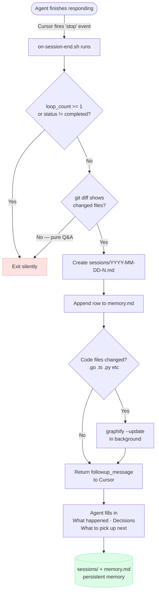

# memory-graph

Give any repo a persistent brain that survives agent sessions.

Three things it does:
1. **`main.mdc`** — a living AI brief always loaded by Cursor. Populated by graphify with architecture, god nodes, and community structure. The agent reads this before touching anything.
2. **Session memory** — after every agent stop **where at least one file was changed**, a hook creates `sessions/YYYY-MM-DD-N.md`. You append caveman-style "why" bullets. `memory.md` is the index. Pure Q&A sessions with no file changes produce no session file.
3. **Graph rebuild** — incremental AST update on every agent stop (fast, no LLM). Full rebuild on every `git commit` (via post-commit hook).

---

## How it works



**Next session:** agent auto-loads `main.mdc` (god nodes + architecture) and scans `memory.md` to know what was decided before starting.

---

## Install (one command, from inside your project)

```bash
cd /your/project
curl -sL https://github.com/SundaraSwani/memory-graph/archive/refs/heads/main.tar.gz \
  | tar -xz --strip-components=1 && bash setup
```

This extracts `.cursor/`, `CLAUDE.md`, `memory.md`, `sessions/` directly into your project — no wrapper folder. Then `bash setup` configures repo name, installs graphify + gstack, and wires the git post-commit hook.
Then run `/graphify .` once to build the initial graph and populate `main.mdc`.

---

## What gets installed

| File | What it does |
|------|-------------|
| `.cursor/rules/main.mdc` | AI brief — always loaded by Cursor (`alwaysApply: true`) |
| `.cursor/hooks.json` | Registers `on-session-end.sh` on the Cursor `stop` event |
| `.cursor/hooks/on-session-end.sh` | Creates session file, updates memory.md, runs graphify, prompts agent |
| `CLAUDE.md` | Points Claude Code to `main.mdc` |
| `memory.md` | Index of all sessions |
| `sessions/` | Per-session decision logs |
| `post-commit.sh` | Full graphify rebuild — installed to `.git/hooks/post-commit` |

---

## How sessions work

The hook fires at agent stop, checks `git diff` (staged + unstaged), and **exits silently if nothing changed**. Only sessions where the agent modified files get a session log.

When files did change:

1. Hook creates `sessions/2026-06-17-1.md` (date + incrementing number per day):
   ```yaml
   ---
   date: 2026-06-17
   time: 14:32
   session: 1
   topics: "src/auth.ts, src/db.ts"
   files_changed: 2
   files:
     - src/auth.ts
     - src/db.ts
   god_nodes_touched: []
   ---
   ```
2. Cursor injects a follow-up asking the agent to fill in three sections:
   ```markdown
   ## What happened
   Added JWT auth. Replaced session middleware.

   ## Decisions
   - JWT not sessions. Stateless. Simpler.
   - auth.ts now god node. Everything touches it.
   - Refresh token deferred. Ship first.

   ## What to pick up next
   - Wire refresh token endpoint
   - Add token expiry tests
   ```
3. `memory.md` index row added automatically.

> **Note:** If the session file already exists and has bullet-point decisions written, the hook skips — re-running the agent won't overwrite your notes.

---

## How the graph stays fresh

| Trigger | What runs | LLM? |
|---------|-----------|------|
| Agent stop (code files changed) | Incremental AST update | No |
| `git commit` | Full `--update` rebuild | Only for new docs/images |
| Manual `/graphify .` | Full pipeline | Yes |

---

## gstack integration

memory-graph installs [gstack](https://github.com/garrytan/gstack) automatically. gstack handles the SDLC; memory-graph handles structural understanding. They are complementary layers:

| Layer | Tool | What it stores |
|-------|------|---------------|
| Structural | graphify → `main.mdc` | Architecture, god nodes, community graph |
| Decisions | `sessions/` + `memory.md` | Per-session "why" logs, indexed |
| Cross-session learnings | gstack `/learn` | Patterns, pitfalls, preferences |
| Persistent knowledge | gstack GBrain (opt-in) | Database-backed memory across machines |

The enforced workflow lives in `.cursor/rules/sdlc.mdc`:
```
grill-me/grill-with-docs → /spec → /autoplan → build → /review → /qa → /ship → capture
```

## Requirements

- Cursor (for hooks + `.mdc` rules)
- Python 3.8+ (for graphify)
- Git
- Bun v1.0+ (for gstack browser features)

graphify and gstack are installed automatically by `setup`.
